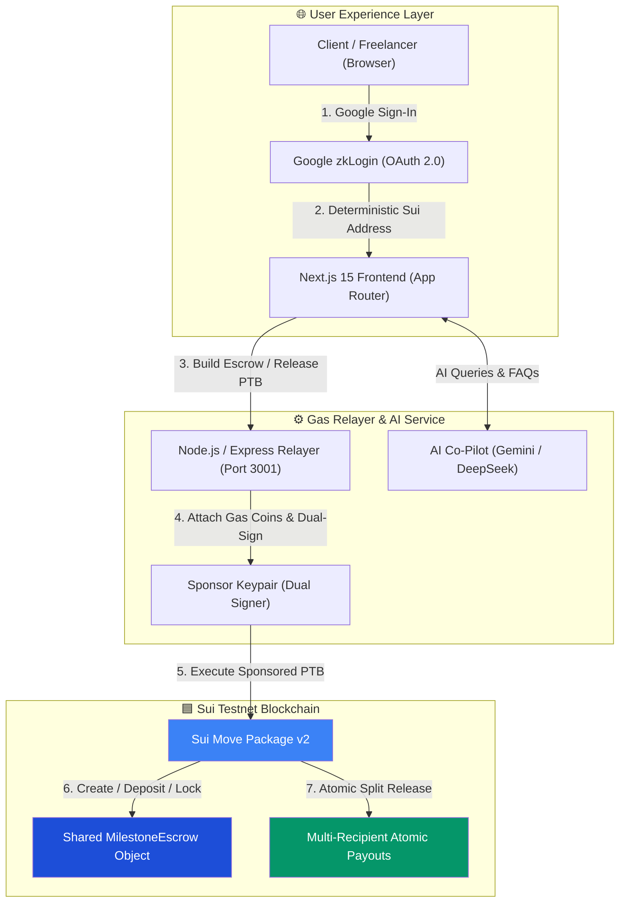
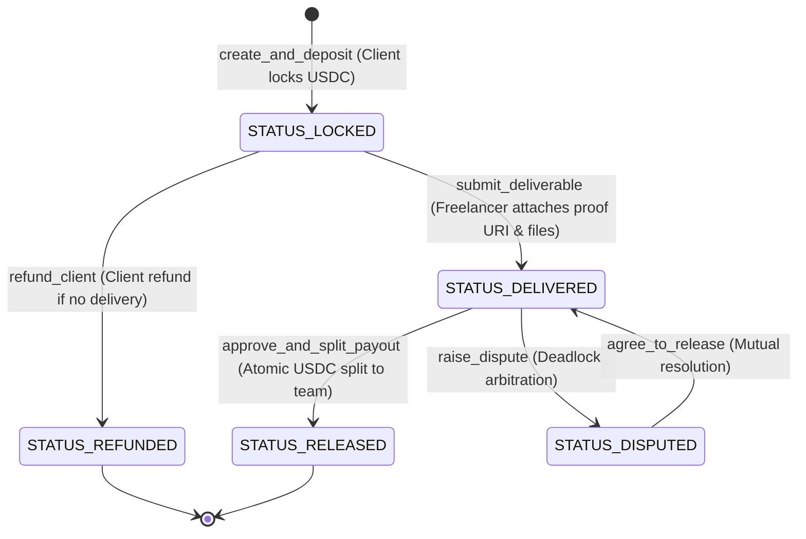

# 🛡️ SuiPact — Zero-Gas Stablecoin Escrow & Atomic Split Payouts on Sui

> **MUBA Blockchain Hackathon 2026**  
> **Track:** Sui Track 01 — Payments & Stablecoins  
> **Target Chain:** Sui Testnet  
> **Payment Asset:** Testnet USDC  
> **Live DApp:** Localhost Port 3000 / Deployed Vercel Endpoint  
> **Package v2 (Current):** [`0x8c57edf140ac229fb7e11652e8d9dcded7fd63dda683adfd7fd9c5bed1db5a18`](https://testnet.suivision.xyz/package/0x8c57edf140ac229fb7e11652e8d9dcded7fd63dda683adfd7fd9c5bed1db5a18)  
> **Package v1 (Initial):** [`0x86edb7211b5b15566739b5a0ae689a669c590a7b0580cbf967c8fd1bc828f1a1`](https://testnet.suivision.xyz/package/0x86edb7211b5b15566739b5a0ae689a669c590a7b0580cbf967c8fd1bc828f1a1)  
> **Upgrade Tx Digest:** [`9yJyrnivjB7LfTgQUobfooZoXezAuTkRp2g761VX537p`](https://suiscan.xyz/testnet/tx/9yJyrnivjB7LfTgQUobfooZoXezAuTkRp2g761VX537p)  
> **Sponsor / Deployer:** [`0xaf39410b7ef60d0de77312789647ca1a9989784229b275d5a7866e4a610e7771`](https://suiscan.xyz/testnet/account/0xaf39410b7ef60d0de77312789647ca1a9989784229b275d5a7866e4a610e7771)

---

## 📑 Quick Navigation for Judges

- [1. Executive Summary & Problem Solved](#1-executive-summary--problem-solved)
- [2. Judge Evaluation Rubric & Key Innovations](#2-judge-evaluation-rubric--key-innovations)
- [3. On-Chain Deployment & Verification](#3-on-chain-deployment--verification)
- [4. System Architecture & PTB Mechanics](#4-system-architecture--ptb-mechanics)
- [5. Smart Contract Lifecycle & Unit Test Matrix](#5-smart-contract-lifecycle--unit-test-matrix)
- [6. Step-by-Step Interactive Demo Walkthrough](#6-step-by-step-interactive-demo-walkthrough)
- [7. Services Marketplace & Direct WhatsApp Inquiry](#7-services-marketplace--direct-whatsapp-inquiry)
- [8. AI Co-Pilot & Quota System](#8-ai-co-pilot--quota-system)
- [9. Project Structure & Codebase Map](#9-project-structure--codebase-map)
- [10. Quickstart & 1-Click Launch](#10-quickstart--1-click-launch)
- [11. Business Model & V2 Production Roadmap](#11-business-model--v2-production-roadmap)
- [12. AI Tools Declaration](#12-declaration-of-ai-tools)

---

## 1. Executive Summary & Problem Solved

### The 20% Web2 Commission Trap & Web3 Usability Friction
Freelance teams and creative agencies worldwide lose **10%–20% of their gross revenue to platform commissions** (Upwork, Fiverr, Freelancer.com), endure **5–14 business days** in wire settlement delays, and face unilateral dispute chargebacks.

While Web3 escrows offer trustless, transparent settlements, traditional crypto dApps suffer from extreme friction:
- Requiring non-crypto clients to install browser extension wallets.
- Forcing users to buy and hold gas tokens (`SUI`/`ETH`) just to approve a milestone.
- Losing track of basis-point payout splits across multi-member agencies.

### The SuiPact Solution
**SuiPact** is a production-ready, zero-gas stablecoin escrow built natively on **Sui Move**. It enables clients to lock testnet USDC deposits and atomically disburse proportional basis-point splits (e.g., 60% Lead, 25% Designer, 15% QA) to entire freelancer teams in **one single Programmable Transaction Block (PTB)**.

Powered by **Google zkLogin (OAuth 2.0)** and a **sponsored gas relayer**, users experience a Web2-smooth interface paying **$0.00 in gas fees** with zero seed phrase management.

---

## 2. Judge Evaluation Rubric & Key Innovations

| Criteria | SuiPact Technical Implementation | Innovation Highlight |
|---|---|---|
| **Track Alignment** | Built exclusively for **Sui Track 01: Payments & Stablecoins**. Locks USDC and executes automated atomic split settlements. | Single-PTB team disbursements replacing fragmented manual payouts. |
| **Technical Depth** | Custom Sui Move v2 smart contract (`suipact_escrow::escrow`) with dual-signed sponsored transactions, deterministic division dust allocation, and object capability safeguards. | 9/9 Move unit tests passing with zero compiler warnings. |
| **UX & Usability** | Google zkLogin authentication, zero-gas sponsor relayer, full-height dark navigator panel, and light-theme dashboard workspace. | Clients and freelancers never need SUI gas tokens to transact. |
| **Services Marketplace** | Integrated freelance gig discovery (`/services`) with direct 1-click **WhatsApp inquiries** and instant pre-filled escrow creation. | Bridges conversational Web2 discovery with trustless on-chain escrows. |
| **AI Integration** | Embedded **SuiPact AI Co-Pilot** in the Demo Sandbox with strict off-topic guardrails, instant zero-token FAQ answers, and 10 free monthly AI queries. | Interactive assistance explaining PTBs, basis points, and zkLogin. |
| **Legal & Audit Trail** | Interactive **Official Pact Agreement & Payment Invoice** modal with printable A4 format, digital signature hashes, and Firebase deliverable storage. | Enterprise-grade legal compliance and audit readiness. |

---

## 3. On-Chain Deployment & Verification

All smart contracts have been compiled with the Move v2 compiler, published to **Sui Testnet**, upgraded to Package v2, and verified on SuiVision and SuiScan:

| Property | Value / Explorer Link |
|---|---|
| **Network** | Sui Testnet (`https://fullnode.testnet.sui.io:443`) |
| **Package v2 (Current)** | [`0x8c57edf140ac229fb7e11652e8d9dcded7fd63dda683adfd7fd9c5bed1db5a18`](https://testnet.suivision.xyz/package/0x8c57edf140ac229fb7e11652e8d9dcded7fd63dda683adfd7fd9c5bed1db5a18) |
| **Package v1 (Initial)** | [`0x86edb7211b5b15566739b5a0ae689a669c590a7b0580cbf967c8fd1bc828f1a1`](https://testnet.suivision.xyz/package/0x86edb7211b5b15566739b5a0ae689a669c590a7b0580cbf967c8fd1bc828f1a1) |
| **Publish Tx Digest** | [`3teRC52TQvDgh9YAVmmoDJvQqMtgUzzpnJgA5QqtQTYf`](https://suiscan.xyz/testnet/tx/3teRC52TQvDgh9YAVmmoDJvQqMtgUzzpnJgA5QqtQTYf) |
| **Upgrade Tx Digest** | [`9yJyrnivjB7LfTgQUobfooZoXezAuTkRp2g761VX537p`](https://suiscan.xyz/testnet/tx/9yJyrnivjB7LfTgQUobfooZoXezAuTkRp2g761VX537p) |
| **UpgradeCap Object** | [`0x377bfe72994ed7f9816118ba012f200b0aacee9c5a2c8b39a949ed7e679fbb11`](https://suiscan.xyz/testnet/object/0x377bfe72994ed7f9816118ba012f200b0aacee9c5a2c8b39a949ed7e679fbb11) |
| **Sponsor Gas Address** | `0xaf39410b7ef60d0de77312789647ca1a9989784229b275d5a7866e4a610e7771` |
| **Move Test Results** | **9 / 9 Passing** (`contracts/suipact_escrow/tests/escrow_tests.move`) |

---

## 4. System Architecture & PTB Mechanics



### Core Technical Pillars:
1. **Single-PTB Atomic Multi-Split:**
   - Basis points calculation: $\sum \text{bps} = 10,000 \text{ (100.00\%)}$.
   - All recipients receive their exact USDC allocations simultaneously in one transaction.
2. **Move Deterministic Dust Allocation:**
   - Any remainder cents resulting from integer division are automatically credited to the last recipient, ensuring zero stranded balance in shared objects.
3. **Zero-Gas Relayer:**
   - The backend attaches sponsor gas coins and signs as gas owner, enabling onboarding of non-crypto users without testnet SUI balances.

---

## 5. Smart Contract Lifecycle & Unit Test Matrix



### Move Unit Test Matrix (`escrow_tests.move`)
Run directly via `sui move test` in `contracts/suipact_escrow`:

| Test Name | Validation Purpose | Status |
|---|---|:---:|
| `test_create_and_deposit_success` | Verifies deposit locking, initial state, and recipient vector correctness | ✅ PASS |
| `test_split_payout_math_correct` | Verifies exact basis-point math (e.g. 7000 bps / 3000 bps) across multiple wallets | ✅ PASS |
| `test_split_payout_dust_goes_to_last_recipient` | Verifies indivisible cent dust is deterministically awarded to the last recipient | ✅ PASS |
| `test_unauthorized_client_cannot_approve` | Confirms non-client callers are rejected with `ENotClient` | ✅ PASS |
| `test_double_release_prevented` | Prevents replay or double-spending on released contracts (`EInvalidStatus`) | ✅ PASS |
| `test_invalid_split_total_rejected` | Rejects split vectors where $\sum \text{bps} \neq 10,000$ with `EInvalidSplitTotal` | ✅ PASS |
| `test_refund_success_when_locked` | Validates client refund before work delivery | ✅ PASS |
| `test_refund_fails_after_delivery` | Blocks client refunds once delivery proof has been submitted | ✅ PASS |
| `test_mutual_dispute_resolution_flow` | Verifies dispute raising, dual-party agreement flags, and unlock | ✅ PASS |

---

## 6. Step-by-Step Interactive Demo Walkthrough

Judges can test the full lifecycle in under 3 minutes using the built-in **Demo Sandbox Controller**:

```
[1. Explore Services] ➡️ [2. Create Escrow] ➡️ [3. Review Agreement] ➡️ [4. Deliver Proof] ➡️ [5. Atomic Release]
```

### Step 1: Browse Services Marketplace (`/services`)
- Navigate to **02. Explore Services** on the left panel.
- Filter by categories (*Sui Move*, *Web3 UI*, *AI Agents*, *Security Audits*).
- Click **WhatsApp Inquire** to preview direct communication, or **Hire Escrow** to pre-populate the escrow creation form.

### Step 2: Create a Zero-Gas Escrow (`/escrow/new`)
- Switch to **Alice (Client)** in the Demo Sandbox.
- Set title, description, and budget (e.g. `$1,000 USDC`).
- Define multi-recipient team splits:
  - **Bob (Lead Freelancer):** `6000 bps` (60.0% · $600 USDC)
  - **Charlie (UI Designer):** `2500 bps` (25.0% · $250 USDC)
  - **David (Backend Engineer):** `1500 bps` (15.0% · $150 USDC)
- Click **Create & Fund Escrow** (Sponsored dual-signed PTB with $0 gas).

### Step 3: Freelancer Agreement Review (`/escrow/[id]`)
- Switch persona to **Bob (Lead Freelancer)**.
- Click **"Review / Modify Agreement"** to inspect the official pact agreement terms, budget breakdown, and digital signatures.
- Accept the baseline terms or propose an adjusted rate counter-offer.

### Step 4: Submit Proof of Delivery (`/escrow/[id]`)
- Enter your deliverable proof link (e.g., `https://github.com/suipact/core-mvp/pull/42`).
- Click **"+ Add Link"** to attach additional Figma or Canva demo links.
- Attach reference documents/PDFs (stored securely via Firebase).
- Click **Submit Deliverable**.

### Step 5: Client Approval & Atomic Split Release (`/escrow/[id]`)
- Switch persona to **Alice (Client)**.
- Review the submitted deliverable proof links and AI deliverable audit report.
- Click **Approve & Release Funds**.
- **Result:** The Sui smart contract executes the atomic PTB payout, distributing $600 to Bob, $250 to Charlie, and $150 to David simultaneously with on-chain SuiScan proof.

---

## 7. Services Marketplace & Direct WhatsApp Inquiry

The **Explore Services** marketplace (`/services`) bridges Web2 client-freelancer discovery with Web3 smart contract guarantees:

- **Category Filters:** Sui Move, Frontend & Web3 UI, Fullstack dApps, AI & LLMs, Security Audits, and UI/UX Design.
- **WhatsApp Integration:** 1-click **WhatsApp Direct** buttons launch pre-filled conversational messages referencing specific services and SuiPact escrow terms.
- **Seamless Escrow Checkout:** Clicking **"Hire Escrow"** automatically passes service parameters to `/escrow/new`, pre-populating title, amount, and freelancer address into the Move PTB builder.

---

## 8. AI Co-Pilot & Quota System

The built-in **SuiPact AI Co-Pilot** in the bottom-right Demo Sandbox provides contextual assistance:

- **Strict Off-Topic Guard:** Uses regex guardrails to reject non-SuiPact queries (cooking, history, sports, etc.) at zero token cost.
- **Instant FAQ Layer (0 Tokens · Unlimited):** Instant pre-compiled responses for common questions (*What is a PTB?*, *How does zkLogin work?*, *What are basis points?*).
- **Monthly Quota System:** 10 free AI queries per month per account, backed by `/api/ai/chat` and `/api/ai/quota` with full reset support for sandbox testing.

---

## 9. Project Structure & Codebase Map

```
Muba/
├── contracts/
│   └── suipact_escrow/
│       ├── Move.toml                    # Package manifest (Move v2)
│       ├── sources/
│       │   └── escrow.move              # Core Move contract: deposits, splits, dust, refunds
│       └── tests/
│           └── escrow_tests.move        # 9/9 Comprehensive Move unit tests
├── backend/
│   ├── server.js                        # Sponsored Gas Relayer, AI Co-Pilot API & Quota Service
│   ├── faucet.js                        # Testnet funding utility
│   └── package.json
├── frontend/
│   ├── src/
│   │   ├── app/
│   │   │   ├── page.tsx                 # Landing Page & Pitch Deck Navigator
│   │   │   ├── login/page.tsx           # zkLogin & Demo Persona Selector
│   │   │   ├── dashboard/page.tsx       # Assigned Contracts & Hired Projects Workspace
│   │   │   ├── services/page.tsx        # Light-Theme Freelance Services Marketplace
│   │   │   ├── escrow/new/page.tsx      # Create Escrow & Basis Point Split Builder
│   │   │   └── escrow/[id]/page.tsx     # Escrow Detail, Timeline, Proof & Multi-Link Actions
│   │   ├── components/
│   │   │   ├── AppSidebar.tsx           # Midnight Navy side navigation panel
│   │   │   ├── AppShell.tsx             # Layout header & footer wrappers
│   │   │   ├── DemoSandboxBar.tsx       # Role switcher, reset tools & AI Co-Pilot
│   │   │   ├── OfficialPactDocumentModal.tsx # Printable A4 Agreement & Payment Invoice
│   │   │   ├── StatusTimeline.tsx       # Horizontal on-chain lifecycle progress bar
│   │   │   └── SplitPieChart.tsx        # Interactive basis points visualization
│   │   ├── context/
│   │   │   ├── AuthContext.tsx          # zkLogin derivation & demo session store
│   │   │   └── EscrowContext.tsx        # State sync & cryptographic role validation
│   │   └── config/
│   │       └── sui.ts                   # Package IDs, RPC endpoints & SuiScan URLs
│   └── package.json
├── README.md                            # Comprehensive Judges' Reference Document
└── start.bat                            # 1-Click Startup Script for Windows
```

---

## 10. Quickstart & 1-Click Launch

### Prerequisites
- **Node.js** v18+ (tested on v24.12)
- **Sui CLI** v1.78+ (configured for Sui Testnet)

### 1-Click Launch (Windows)
Double-click `start.bat` in the root folder, or execute:
```powershell
.\start.bat
```

### Manual Service Startup
```bash
# Terminal 1: Smart Contract Tests
cd contracts/suipact_escrow
sui move test

# Terminal 2: Gas Relayer & AI Backend (Port 3001)
cd ../../backend
npm install && npm start

# Terminal 3: Next.js Frontend (Port 3000)
cd ../frontend
npm install && npm run dev
```

---

## 11. Business Model & V2 Production Roadmap

### Unit Economics vs. Web2 Freelance Platforms
| Metric | Upwork / Fiverr | Traditional Crypto Escrows | SuiPact |
|---|---|---|---|
| **Platform Commission** | **10% – 20%** | 1% – 3% | **0.0% (Zero-Fee Base Pacts)** |
| **Gas Fee for User** | N/A ($0 crypto, but high bank fees) | $1.50 – $15.00 | **$0.00 (100% Sponsored Gas)** |
| **Payout Distribution** | Manual wire transfer (5–14 days) | Single wallet address | **Atomic Multi-Split in 1 PTB** |
| **Authentication** | Email / Password | Seed phrase / Extension wallet | **Google zkLogin (OAuth 2.0)** |
| **Dispute Resolution** | Centralized platform bias | Complex on-chain DAO | **AI Arbitration & Mutual Consent** |

### V2 Production Roadmap
1. **Multi-Milestone Tranches:** Incremental milestone deliverables with time-locked fund releases.
2. **Kleros-Style Juror Pool on Sui:** Staked community juror voting for deadlocked high-value disputes with a 14-day inactivity auto-release timeout.
3. **Multi-Relayer Gas Pool:** Decentralized sponsor relayer network with automated treasury liquidity rebalancing.
4. **Fiat On/Off Ramp Integration:** Direct Stripe Connect / MoonPay USDC settlement bridging to local bank accounts (e.g. DuitNow / SEPA / ACH).

---

## 12. Declaration of AI Tools

In compliance with **Section 4 of the MUBA Hackathon Rulebook**, the team utilized AI tools (Antigravity IDE by Google DeepMind / Gemini 3.7 Flash) for code pair programming, Move unit test case generation, and responsive UI scaffolding. All Move smart contract code, cryptographic relayer pipelines, and deployment artifacts have been authored, tested, and verified on **Sui Testnet**.
