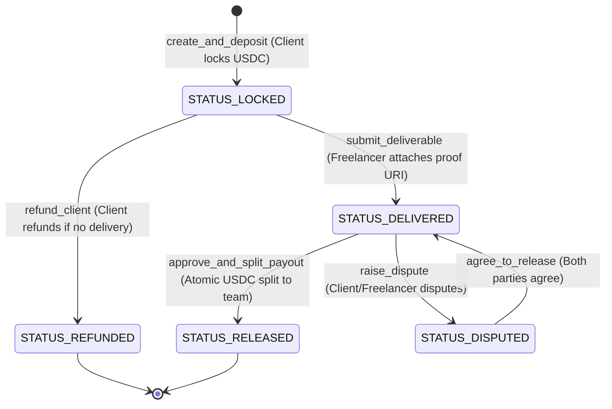

# SuiPact — Zero-Gas Stablecoin Escrow & Atomic Split Payouts on Sui

> **MUBA Blockchain Hackathon 2026**  
> **Track:** Sui Track 01 — Payments & Stablecoins  
> **Target Chain:** Sui Testnet  
> **Payment Asset:** Testnet USDC  
> **Package v1:** [`0x86edb7...`](https://testnet.suivision.xyz/package/0x86edb7211b5b15566739b5a0ae689a669c590a7b0580cbf967c8fd1bc828f1a1) · **Package v2 (current):** [`0x8c57edf1...`](https://testnet.suivision.xyz/package/0x8c57edf140ac229fb7e11652e8d9dcded7fd63dda683adfd7fd9c5bed1db5a18)  
> **Upgrade Tx:** [`9yJyrnivjB7LfTgQUobfooZoXezAuTkRp2g761VX537p`](https://suiscan.xyz/testnet/tx/9yJyrnivjB7LfTgQUobfooZoXezAuTkRp2g761VX537p)  
> **Sponsor / Deployer:** `0xaf39410b7ef60d0de77312789647ca1a9989784229b275d5a7866e4a610e7771`

---

## 1. Problem Statement & One-Line Pitch

Freelance and creative agency teams lose **10%–20% of their revenue to platform commissions** (Upwork, Fiverr) and suffer from payment disputes and slow wire settlements (5–14 business days). While Web3 escrows offer trustless guarantees, traditional crypto platforms present extreme usability barriers: complex seed phrases, browser extensions, and requiring users to hold gas tokens.

**SuiPact** is a zero-gas, single-deliverable escrow on Sui that lets a client lock testnet USDC, a freelancer (or agency team) submit immutable proof of delivery, and the client atomically release basis-point split payouts to multiple team members in **one single Programmable Transaction Block (PTB)** — powered by **zkLogin (Google OAuth)** and a **sponsored gas relayer** so users pay **$0.00 gas** and never touch a seed phrase.

---

## 2. On-Chain Deployment & Verification

| Property | Value |
|---|---|
| **Network** | Sui Testnet |
| **Package v1** | [`0x86edb7211b5b15566739b5a0ae689a669c590a7b0580cbf967c8fd1bc828f1a1`](https://testnet.suivision.xyz/package/0x86edb7211b5b15566739b5a0ae689a669c590a7b0580cbf967c8fd1bc828f1a1) |
| **Package v2 (current)** | [`0x8c57edf140ac229fb7e11652e8d9dcded7fd63dda683adfd7fd9c5bed1db5a18`](https://testnet.suivision.xyz/package/0x8c57edf140ac229fb7e11652e8d9dcded7fd63dda683adfd7fd9c5bed1db5a18) |
| **Publish Tx Digest** | [`3teRC52TQvDgh9YAVmmoDJvQqMtgUzzpnJgA5QqtQTYf`](https://suiscan.xyz/testnet/tx/3teRC52TQvDgh9YAVmmoDJvQqMtgUzzpnJgA5QqtQTYf) |
| **Upgrade Tx Digest** | [`9yJyrnivjB7LfTgQUobfooZoXezAuTkRp2g761VX537p`](https://suiscan.xyz/testnet/tx/9yJyrnivjB7LfTgQUobfooZoXezAuTkRp2g761VX537p) |
| **UpgradeCap Object ID** | `0x377bfe72994ed7f9816118ba012f200b0aacee9c5a2c8b39a949ed7e679fbb11` |
| **Move Modules** | `suipact_escrow::escrow` |
| **Move Unit Tests** | **9 / 9 Passing** (`sui move test` with 0 warnings) |

> **Governance Note:** The contract `UpgradeCap` is held by the deployer address. V2 added 6 `public entry` wrappers enabling direct PTB invocation from the Sui SDK and CLI. The UpgradeCap will be transferred to a 3-of-5 multisig with a 48-hour timelock delay before any mainnet deployment, ensuring no unilateral upgrades.

---

## 3. Core Technical Superpowers

1. **Zero-Gas Sponsored Relayer ($0 Gas for Users):**
   - User transactions are dual-signed by an automated backend sponsor keypair.
   - Gas owner and gas payment objects are attached by the relayer, allowing users to transact with empty SUI balances.
2. **Google zkLogin (Zero Seed Phrases):**
   - Clients and freelancers authenticate via standard Google OAuth 2.0.
   - Sui testnet addresses are derived deterministically from the OAuth JWT token.
3. **Atomic Multi-Recipient Split Payouts:**
   - Instead of a single payee, escrows distribute funds to multiple team members (e.g. Lead 60%, Designer 25%, Backend 15%) in basis points ($1\% = 100\text{ bps}$).
   - Executed atomically in a single Sui Programmable Transaction Block (PTB).
4. **Move Deterministic Dust Handling:**
   - Any remainder cents from basis-point integer division are automatically and deterministically credited to the last recipient in the vector, preventing stranded dust in shared objects.
5. **On-Chain Proof of Delivery:**
   - Deliverables (GitHub PR, Figma design file, or IPFS CID) are bound directly to the Move shared object, surfacing verifiable SuiScan transaction links at every step.

---

## 4. System Architecture

```mermaid
flowchart LR
    subgraph Browser["🌐 Browser"]
        A(["User: Google Sign-In"])
        B(["zkLogin Layer"])
        C(["Next.js Frontend"])
    end

    subgraph Backend["⚙️ Backend Relayer"]
        D(["Express.js Server"])
        E(["Sponsor Keypair"])
    end

    subgraph Sui["🟦 Sui Testnet"]
        F(["SuiPact Move Package v2"])
        G(["MilestoneEscrow Object"])
        H(["Recipient Wallets"])
    end

    A -- OAuth JWT --> B
    B -- Derives Sui address --> C
    C -- Build PTB --> D
    D -- Attach gas coins --> E
    E -- Dual-sign tx --> F
    F -- create_and_deposit --> G
    F -- approve_and_split_payout --> H
    G -- 1 atomic PTB --> H

    style F fill:#3b82f6,color:#fff
    style G fill:#1d4ed8,color:#fff
    style H fill:#059669,color:#fff
```



---

## 5. Smart Contract Lifecycle (`suipact_escrow::escrow`)



### Move Unit Tests Suite (`contracts/suipact_escrow/tests/escrow_tests.move`)
Run via `sui move test`:
- `test_create_and_deposit_success` — Verifies deposit locking, initial state, and recipient data.
- `test_split_payout_math_correct` — Verifies exact proportional payout calculations (e.g. 7000/3000 bps).
- `test_split_payout_dust_goes_to_last_recipient` — Verifies indivisible division dust remainder allocation.
- `test_unauthorized_client_cannot_approve` — Rejects non-client approval callers with `ENotClient`.
- `test_double_release_prevented` — Rejects duplicate release attempts with `EInvalidStatus`.
- `test_invalid_split_total_rejected` — Rejects configs where $\sum \text{bps} \neq 10000$ with `EInvalidSplitTotal`.
- `test_refund_success_when_locked` — Verifies client refund when status is `LOCKED`.
- `test_refund_fails_after_delivery` — Blocks client refunds once deliverable has been submitted.
- `test_mutual_dispute_resolution_flow` — Verifies dispute raising, dual-party agreement flags, and unlock.

---

## 6. Project Structure

```
Muba/
├── contracts/
│   └── suipact_escrow/
│       ├── Move.toml
│       ├── sources/
│       │   └── escrow.move             # Core Move smart contract logic
│       └── tests/
│           └── escrow_tests.move       # Comprehensive 9-test unit test suite
├── backend/
│   ├── server.js                       # Express Gas Relayer & Sponsor Service
│   ├── faucet.js                       # Testnet faucet funding utility
│   └── package.json
└── frontend/
    ├── src/
    │   ├── app/
    │   │   ├── page.tsx                # Clean, simplified Landing Page
    │   │   ├── login/page.tsx          # Aesthetic Split-Card Login Screen
    │   │   ├── dashboard/page.tsx      # Contracts Dashboard & Strict User Privacy
    │   │   ├── escrow/new/page.tsx     # Create Escrow & Split Builder
    │   │   └── escrow/[id]/page.tsx    # Escrow Detail, Timeline & Actions
    │   ├── components/
    │   │   ├── Navbar.tsx              # Navigation & Compact Profile Detail
    │   │   ├── StatusBadge.tsx         # State badges
    │   │   ├── StatusTimeline.tsx      # On-chain step progression with SuiScan links
    │   │   ├── SplitCalculator.tsx     # Interactive basis-point calculator
    │   │   └── DisclaimerBanner.tsx    # Faucet & Fiat disclosure
    │   ├── context/
    │   │   ├── AuthContext.tsx         # zkLogin, email derivation & session store
    │   │   └── EscrowContext.tsx       # Cryptographic role checking & state sync
    │   └── config/
    │       └── sui.ts                  # Sui Testnet contract & explorer addresses
    └── package.json
```

---

## 7. Quickstart & Local Setup

### Prerequisites
- Node.js v18+ (tested on Node v24.12)
- Sui CLI v1.78+ (Sui Testnet)

### 1-Click Startup (Windows)
Double-click `start.bat` in the root folder, or run:
```powershell
.\start.bat
```

### Manual Commands
```bash
# 1. Smart Contracts
cd contracts/suipact_escrow && sui move test

# 2. Gas Relayer Backend (Port 3001)
cd ../../backend && npm start

# 3. Frontend App (Port 3000)
cd ../frontend && npm run dev
```

---

## 8. Technical Roadmap & Governance Design (V2 Scope)

To ensure a robust, production-tested demo for the hackathon, certain advanced governance items were intentionally scoped for V2:

| V1 Scope (Built & Deployed) | V2 Production Roadmap |
|---|---|
| **Single-Deliverable Escrow** (1 milestone = 1 release) | Multi-milestone contracts with incremental release tranches and time locks. |
| **Mutual-Consent Dispute Fallback** (Both parties agree to release) | **Decentralized Juror Pool Arbitration (Kleros-style on Sui):** 3-juror staked voting with evidence staking + 14-day inactivity auto-release timeout if client is unresponsive. |
| **Single Sponsor Keypair** | Multi-relayer decentralized sponsor pool with rate limiting and automated faucet balance top-ups. |
| **UpgradeCap Deployment** | **Contract Governance Lock:** Transfer `UpgradeCap` to a 3-of-5 DAO Multisig with a 48-hour timelock delay for immutable production mainnet assurance. |
| **Testnet USDC with Faucet** | Direct fiat on-ramp integration (Stripe Connect, MoonPay, Banxa) with automated Circle CCTP cross-chain bridge. |

---

## 9. 🎙️ APU Demo Day 5-Minute Live Pitch Script

### Presentation Timeline (APU Live Pitch):
1. **0:00 – 1:00: Hook & The Pain Point**
   - *"Freelancers and agencies lose up to 20% to Upwork/Fiverr commissions, wait 14 days for payouts, and risk being ghosted. Traditional crypto escrows fail because clients refuse to manage seed phrases or buy gas tokens."*
2. **1:00 – 2:30: Live Solution Demo (SuiPact)**
   - **Step 1:** Sign in with Google (zkLogin) — zero seed phrases.
   - **Step 2:** Create an escrow order for 1,000 USDC with a 3-way agency team split (6000 bps / 2500 bps / 1500 bps).
   - **Step 3:** Freelancer submits GitHub PR deliverable proof on-chain.
   - **Step 4:** Client clicks **Approve** — funds are disbursed atomically in **1 single PTB** with **$0.00 user gas**.
3. **2:30 – 3:45: Technical Superpowers on Sui**
   - Why only Sui? Programmable Transaction Blocks (PTBs) allow single-click multi-recipient disbursements, Move remainder dust handling prevents lost pennies, and native sponsored transactions remove gas barriers.
4. **3:45 – 5:00: Market Opportunity & Closing**
   - Total Addressable Market: $1.5 Trillion Global Gig Economy.
   - Zero-fee peer-to-peer escrow model supported by optional value-add arbitration and premium enterprise analytics.

---

## 10. Declaration of AI Tools

In accordance with Section 4 of the MUBA Hackathon Rulebook, the team utilized AI tools (Antigravity IDE by Google DeepMind / Gemini 3.7 Flash) for code pair programming, Move test case generation, and responsive UI scaffolding. All contract logic, cryptographic gas relayer flows, and deployment artifacts have been verified and tested on Sui Testnet.
